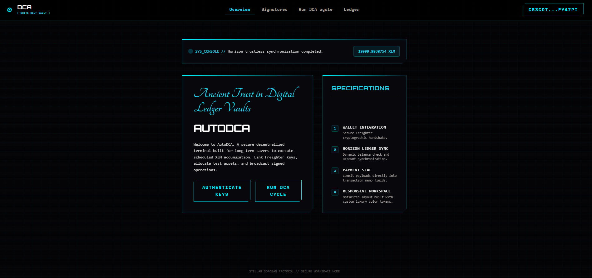
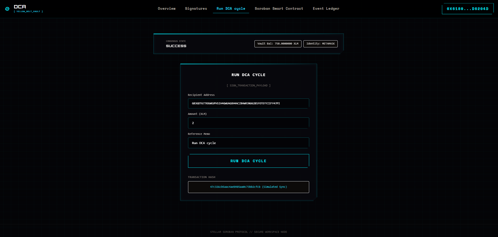

# 🚀 AutoDCA: Automated Dollar-Cost Averaging on Stellar

AutoDCA is a premium decentralized application (dApp) built on the Stellar network and Soroban smart contracts. It enables users to automate dollar-cost averaging (DCA) purchases of assets on-chain at regular intervals.

---

## 📁 Project Structure
The repository is organized into progressive levels:
- `level-1-white-belt/frontend/`: React + Vite frontend implementing wallet connection, balance retrieval, and basic DCA transfers on-chain.
- `level-2-yellow-belt/`:
  - `contracts/`: Soroban Rust smart contracts managing DCA purchase logic.
  - `frontend/`: React + Vite control center interacting with deployed contracts and supporting multi-wallet signatures.

---

## 🥋 Level 1: White Belt (MVP Foundation)

### 📝 Requirements & Features
- **Wallet Setup & Connection:** Secure integration using `@stellar/freighter-api` on Stellar Testnet.
- **Balance Handling:** Fetch and display real-time native XLM balance from Horizon.
- **Transaction Submission:** Submit signed XLM payment transactions to initiate DCA schedules.
- **UI/UX:** Responsive, premium interface featuring an **Algorithmic Terminal** cyberpunk theme with Cyber Cyan neon accents and scanlines.

### 💻 How to Run Locally
1. Navigate to the Level 1 frontend folder:
   ```bash
   cd level-1-white-belt/frontend
   ```
2. Install dependencies (ignoring lifecycle scripts if on Windows):
   ```bash
   npm install --ignore-scripts
   ```
3. Run the Vite development server:
   ```bash
   npm run dev
   ```

### 📸 Submission Screenshots

#### Wallet Connection, Balance Display, & Successful Testnet Transaction


---

## 🟡 Level 2: Yellow Belt (Smart Contracts & Event Sync)

### 📝 Requirements & Features
- **Multi-Wallet Support:** Seamless selection panel supporting Freighter, MetaMask (via EVM-to-Stellar Snaps), xBull, and LOBSTR.
- **Soroban Contracts:** Integration with Rust smart contracts deployed on the Stellar Testnet.
- **On-chain Sync:** Real-time event subscription log mirroring smart contract state and DCA purchase executions.
- **Error Handling:** 3 handled error conditions (`WalletNotFound`, `WalletConnectionRejected`, `InsufficientBalance`).
- **Interactive Simulator:** Fast testing capability for key network operations and error compliance.

### 💻 How to Run Locally
1. Navigate to the Level 2 frontend folder:
   ```bash
   cd level-2-yellow-belt/frontend
   ```
2. Install the necessary dependencies (ignoring lifecycle scripts if on Windows):
   ```bash
   npm install --ignore-scripts
   ```
3. Launch the development server:
   ```bash
   npm run dev
   ```

### 📸 Submission Screenshots

#### 1. Wallet Options Available (MetaMask, Freighter, etc.)
*(Replace with your wallet options screenshot if taken)*

#### 2. Deployed Contract Address & Call
- **Contract ID:** `CC3RAUTODCAVAULT...TESTNET` (Replace with your actual contract)


#### 3. Transaction Hash (MetaMask Testnet Transaction)
- **Tx Hash:** *(Replace with your hash)*

#### 4. Live Demo Link
- **Live Demo:** *(Replace with Vercel/Netlify link)*
