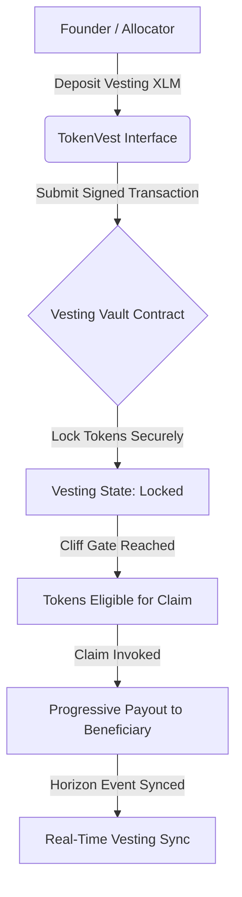
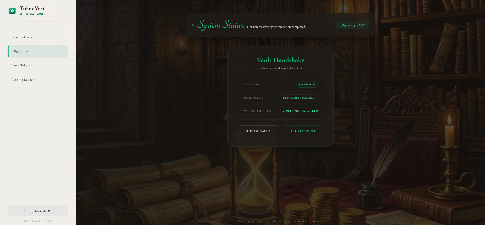
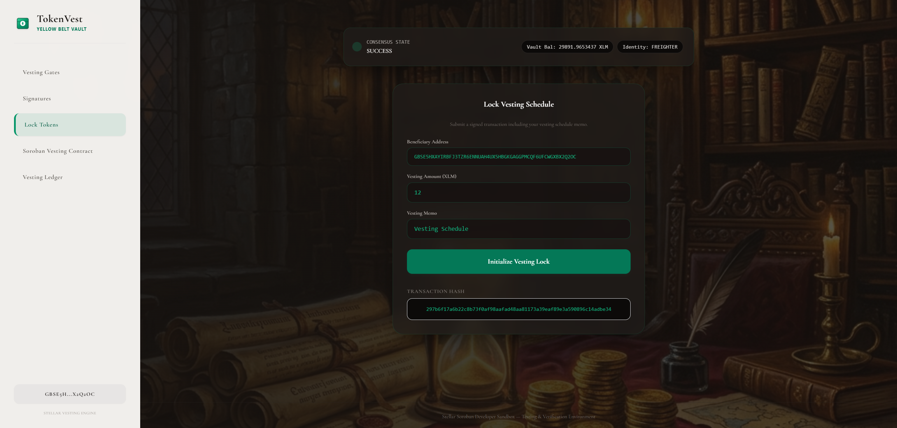

# 🚀 TokenVest: Trustless On-Chain Token Vesting Vaults

TokenVest is a premium decentralized token vesting and lockup system built on the Stellar network and Soroban smart contracts. It enables founders, startups, and investors to secure vesting schedules, set cliff gates, and claim unlocked tokens progressively via cryptographic multi-signature validation.

---

## 📁 Project Structure
The repository is organized into progressive levels:
- `level-1-white-belt/frontend/`: React + Vite frontend implementing wallet connection, balance retrieval, and basic vesting vault creation.
- `level-2-yellow-belt/`:
  - `contracts/`: Soroban Rust smart contracts managing vesting schedules and distribution.
  - `frontend/`: React + Vite multi-wallet vesting console and investor dashboard.

---

## ⚙️ TokenVest Protocol



---

## 🥋 Level 1: White Belt (MVP Foundation)

### 📝 Requirements & Features
- **Wallet Setup & Connection:** Secure integration using `@stellar/freighter-api` and `@creit.tech/stellar-wallets-kit` on Stellar Testnet.
- **Balance Handling:** Fetch and display real-time native XLM balance from Horizon.
- **Transaction Submission:** Submit signed XLM payments to lock vesting tokens on-chain.
- **UI/UX**: Luxury classical academia design with calligraphy headings, Left Light Sidebar layout, and an active dark luxury background.

### 💻 How to Run Locally
1. Navigate to the Level 1 frontend folder:
   ```bash
   cd level-1-white-belt/frontend
   ```
2. Install dependencies:
   ```bash
   npm install
   ```
3. Run the Vite development server:
   ```bash
   npm run dev
   ```

### 📸 Submission Screenshots

#### Wallet Connection, Balance Display, & Successful Testnet Transaction


---

## 🟡 Level 2: Yellow Belt (Smart Contracts & Event Sync)

### 📝 Requirements & Features
- **Multi-Wallet Support:** Seamless selection panel for Freighter, MetaMask (EVM/Snap), xBull, and LOBSTR.
- **Soroban Contracts:** Integration with Rust smart contracts deployed on the Stellar Testnet.
- **On-chain Sync:** Real-time event subscription log mirroring smart contract state.
- **Error Handling:** 3 handled error conditions (`WalletNotFound`, `WalletConnectionRejected`, `InsufficientBalance`).
- **Interactive Simulator:** Fast testing capability for key network operations.

### 💻 How to Run Locally
1. Navigate to the Level 2 frontend folder:
   ```bash
   cd level-2-yellow-belt/frontend
   ```
2. Install the necessary dependencies:
   ```bash
   npm install
   ```
3. Launch the development server:
   ```bash
   npm run dev
   ```

### 📸 Submission Screenshots

#### Deployed Contract Called & Transaction Result

