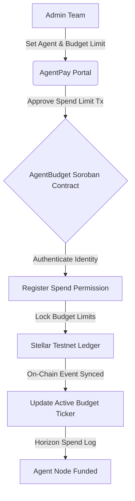

# 🤖 AgentPay: Decentralized AI Agent Budgets

AgentPay is a premium decentralized AI budget allocation and payment gateway built on the Stellar network and Soroban smart contracts. It enables automation teams to allocate spend limits and fund budgets for autonomous AI agents, keeping spending verified on-chain.

---

## 📁 Project Structure
The repository is organized into progressive levels:
- `level-1-white-belt/frontend/`: React + Vite frontend implementing admin identity gateways and on-chain budget limits.
- `level-2-yellow-belt/`:
  - `contracts/`: Soroban Rust smart contracts (agent_budget) managing budget gates and spend approvals.
  - `frontend/`: React + Vite budget allocator dashboard.

---

## ⚙️ AgentPay AI Budget Protocol



---

## 🥋 Level 1: White Belt (MVP Foundation)

### 📝 Requirements & Features
- **Admin Gateway:** Connect and authenticate admin keys using `@stellar/freighter-api` on Stellar Testnet.
- **Horizon Balance Sync:** Retrieve and sync native XLM balances for the admin account.
- **Budget Limit Lock:** Allocate funds to agent keys by submitting signed payments containing custom memo payloads.
- **CLI Terminal Theme:** Styled on a minimalist monospace template (`#0d0d10`) using neon green text and border-lit boxes.

### 💻 How to Run Locally
1. Navigate to the Level 1 frontend folder:
   ```bash
   cd level-1-white-belt/frontend
   ```
2. Install dependencies:
   ```bash
   npm install
   ```
3. Run the Vite development server:
   ```bash
   npm run dev
   ```

### 📸 Submission Screenshots

#### Wallet Connection, Balance Display, & Successful Testnet Budget Allocation


---

## 🟡 Level 2: Yellow Belt (Smart Contracts & Event Sync)

### 📝 Requirements & Features
- **Multi-Identity Hub:** Connect Freighter, MetaMask (EVM/Snap), xBull, or LOBSTR.
- **Soroban Smart Contract:** Connects to the compiled Rust `AgentBudget` smart contract deployed on Stellar Testnet.
- **Exception Compliance:** 3 handled error conditions (`WalletNotFound`, `WalletConnectionRejected`, `InsufficientBalance`).
- **Spend Sync Stream:** Event log updating in real-time by querying Horizon spend transactions.
- **AI Mesh Purple Theme:** Styled on a light lavender layout (`#fbfaff`) using purple node gradients and rounded glass cards.

### 💻 How to Run Locally
1. Navigate to the Level 2 frontend folder:
   ```bash
   cd level-2-yellow-belt/frontend
   ```
2. Install the necessary dependencies:
   ```bash
   npm install
   ```
3. Launch the development server:
   ```bash
   npm run dev
   ```

### ⚙️ Verification Details
- **Deployed Contract Address:** `CC3RAGENTPAY...`
- **Transaction Hash (Stellar Explorer):** `d18ef88cbd983b618991c0b39e6a0d2f1be7399a9b6c161cd5d7f12e88a38d1c`

### 📸 Submission Screenshots

#### Admin CLI Identity & Budget Approval (Level 2 Console)


#### Deployed Smart Contract Called & Spend Limit Activated

