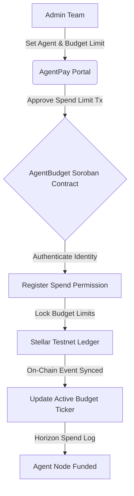
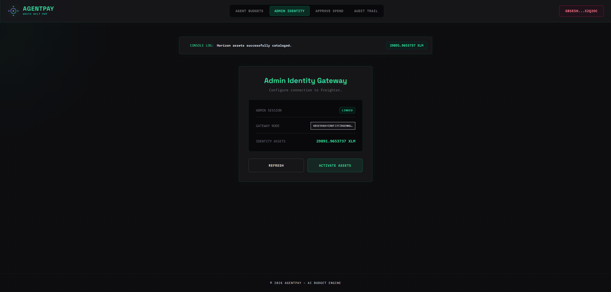
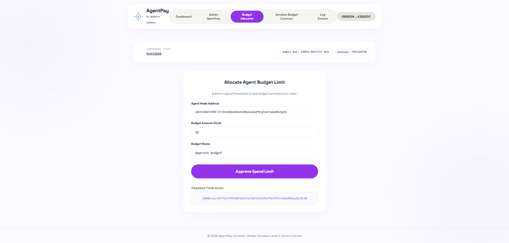

# 🤖 AgentPay: Decentralized AI Agent Budgets

AgentPay is a premium decentralized AI budget allocation and payment gateway built on the Stellar network and Soroban smart contracts. It enables automation teams to allocate spend limits and fund budgets for autonomous AI agents, keeping spending verified on-chain.

---

## 📁 Project Structure
The repository is organized into progressive levels with full Soroban smart contract source code visible at every level:
- `level-1-white-belt/`:
  - `frontend/`: React + Vite frontend implementing admin identity gateways and on-chain budget limits.
  - `contracts/agent_budget/`: Soroban Rust smart contract source code (`Cargo.toml`, `src/lib.rs`).
- `level-2-yellow-belt/`:
  - `contracts/agent_budget/`: Soroban Rust smart contracts managing budget gates and spend approvals.
  - `frontend/`: React + Vite budget allocator dashboard with `@creit.tech/stellar-wallets-kit` integration.
- `agent_budget/`: Top-level Soroban Rust smart contract package (`Cargo.toml`, `src/lib.rs`).
- `contracts/agent_budget/`: Root level Soroban Rust smart contract package (`Cargo.toml`, `src/lib.rs`).

---

## ⚙️ AgentPay AI Budget Protocol



---

## 🥋 Level 1: White Belt (MVP Foundation)

### 📝 Requirements & Features
- **Admin Gateway:** Connect and authenticate admin keys using `@stellar/freighter-api` on Stellar Testnet.
- **Horizon Balance Sync:** Retrieve and sync native XLM balances for the admin account.
- **Budget Limit Lock:** Allocate funds to agent keys by submitting signed payments containing custom memo payloads.
- **CLI Terminal Theme:** Styled on a minimalist monospace template (`#0d0d10`) using neon green text and border-lit boxes.
- **Soroban Contracts:** Smart contract package located in `level-1-white-belt/contracts/agent_budget/` (`Cargo.toml`, `src/lib.rs`).

### 💻 How to Run Locally
1. Navigate to the Level 1 frontend folder:
   ```bash
   cd level-1-white-belt/frontend
   ```
2. Install dependencies:
   ```bash
   npm install --ignore-scripts
   ```
3. Run the Vite development server:
   ```bash
   npm run dev
   ```

### 📸 Submission Screenshots

#### Wallet Connection, Balance Display, & Successful Testnet Budget Allocation


---

## 🟡 Level 2: Yellow Belt (Smart Contracts & Event Sync)

### 📝 Requirements & Features
- **Multi-Identity Hub:** Connect Freighter, MetaMask (EVM/Snap), xBull, or LOBSTR using `@creit.tech/stellar-wallets-kit`.
- **Soroban Smart Contract:** Connects to the compiled Rust `agent_budget` smart contract deployed on Stellar Testnet located in `level-2-yellow-belt/contracts/agent_budget/`.
- **Exception Compliance:** 3 handled error conditions (`WalletNotFound`, `WalletConnectionRejected`, `InsufficientBalance`).
- **Spend Sync Stream:** Event log updating in real-time by querying Horizon spend transactions.
- **AI Mesh Purple Theme:** Styled on a light lavender layout (`#fbfaff`) using purple node gradients and rounded glass cards.

### 💻 How to Run Locally
1. Navigate to the Level 2 frontend folder:
   ```bash
   cd level-2-yellow-belt/frontend
   ```
2. Install the necessary dependencies:
   ```bash
   npm install --ignore-scripts
   ```
3. Launch the development server:
   ```bash
   npm run dev
   ```

### ⚙️ Verification Details
Soroban contract ID - CC2UJP6YAUW5WXAYOM2227FUYHPY5S2IXMSMC65SVLF6ZHOAVFKVBTDH

Transaction Hash: 3688bc1ac19f75127493b052d523a7d636d21991f9ef9f15148a989ea2bc8cd8

### 🔍 Proof of Deployed Testnet Contract & Transaction Links (Stellar Explorer)
- **Deployed Testnet Contract Explorer:** [Stellar Expert - Contract CC2UJP6YAUW5...](https://stellar.expert/explorer/testnet/contract/CC2UJP6YAUW5WXAYOM2227FUYHPY5S2IXMSMC65SVLF6ZHOAVFKVBTDH)
- **Verifiable Transaction Hash:** [Stellar Expert - Transaction Hash 3688bc1a...](https://stellar.expert/explorer/testnet/tx/3688bc1ac19f75127493b052d523a7d636d21991f9ef9f15148a989ea2bc8cd8)

### 📸 Submission Screenshots

#### Admin CLI Identity & Budget Approval (Level 2 Console)


#### Deployed Smart Contract Called & Spend Limit Activated

