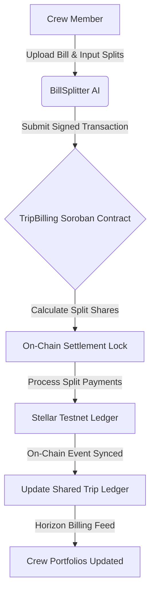
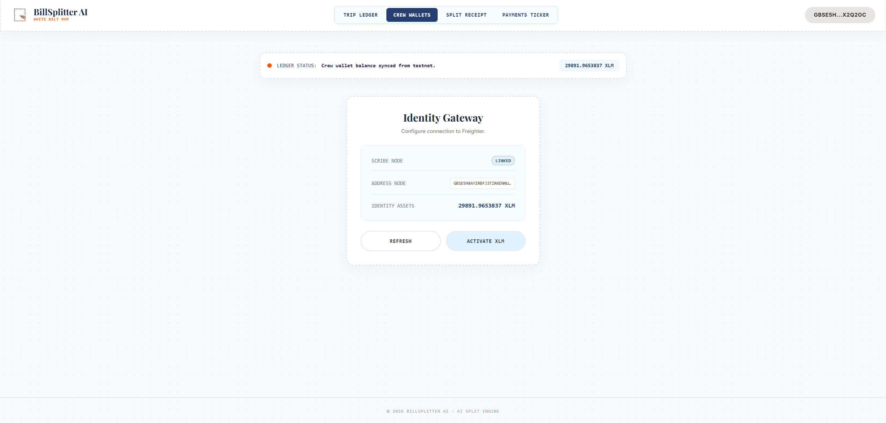
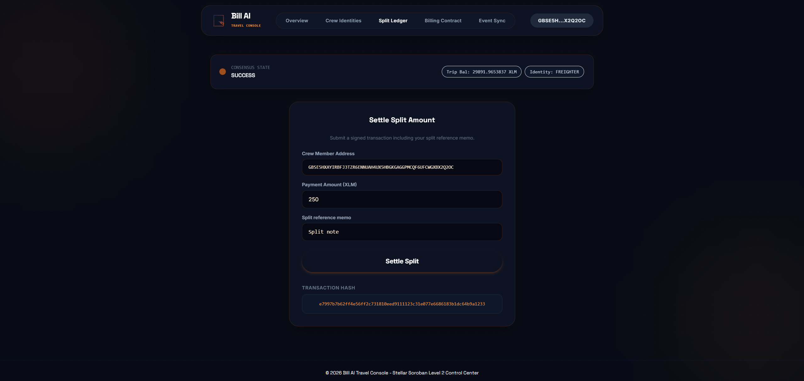

# ✈️ BillSplitter AI: Decentralized Travel Ledger Splits

BillSplitter AI is a premium decentralized trip billing and bill division platform built on the Stellar network and Soroban smart contracts. It enables travel crews to allocate and split bills dynamically, committing split fractions and receipts directly to on-chain ledgers.

---

## 📁 Project Structure
The repository is organized into progressive levels:
- `level-1-white-belt/frontend/`: React + Vite frontend implementing freighter crew wallets setup and basic split payments.
- `level-2-yellow-belt/`:
  - `contracts/`: Soroban Rust smart contracts managing trip registries and expense subdivisions.
  - `frontend/`: React + Vite travel console and split controller.

---

## ⚙️ BillSplitter AI Settlement Protocol



---

## 🥋 Level 1: White Belt (MVP Foundation)

### 📝 Requirements & Features
- **Crew Identity Gate:** Secure freighter wallet connection and authentication on Stellar Testnet.
- **Trip Balance Tracker:** Retrieve and display crew member balances from Horizon Testnet.
- **Split Form Forms:** Settle bills by submitting signed payments containing custom travel memos.
- **Sky Blue Travel Theme:** Styled on a soft sky-blue template (`#f7fafc`) using elegant serif titles and dashed-border ticket cards.

### 💻 How to Run Locally
1. Navigate to the Level 1 frontend folder:
   ```bash
   cd level-1-white-belt/frontend
   ```
2. Install dependencies:
   ```bash
   npm install
   ```
3. Run the Vite development server:
   ```bash
   npm run dev
   ```

### 📸 Submission Screenshots

#### Wallet Connection, Balance Display, & Successful Testnet Split Transaction


---

## 🟡 Level 2: Yellow Belt (Smart Contracts & Event Sync)

### 📝 Requirements & Features
- **Multi-Identity Hub:** Connect Freighter, MetaMask (EVM/Snap), xBull, or LOBSTR.
- **Soroban Smart Contract:** Connects to the compiled Rust `TripBilling` smart contract deployed on Stellar Testnet.
- **Exception Compliance:** 3 handled error conditions (`WalletNotFound`, `WalletConnectionRejected`, `InsufficientBalance`).
- **Audit Sync Stream:** Event log that updates in real-time by querying Horizon billing transactions.
- **Orange Travel Theme:** Styled on a neon night layout (`#080b15`) using sunset orange highlights and glowing card containers.

### 💻 How to Run Locally
1. Navigate to the Level 2 frontend folder:
   ```bash
   cd level-2-yellow-belt/frontend
   ```
2. Install the necessary dependencies:
   ```bash
   npm install
   ```
3. Launch the development server:
   ```bash
   npm run dev
   ```

### ⚙️ Verification Details
Testnet (CC2UJP6YAUW5WXAYOM2227FUYHPY5S2IXMSMC65SVLF6ZHOAVFKVBTDH)

### 📸 Submission Screenshots

#### Deployed Smart Contract Called, Event Logger Sync, & Successful Transaction

