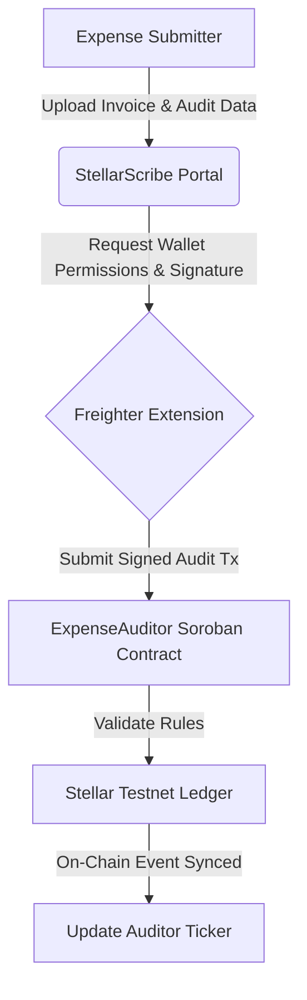
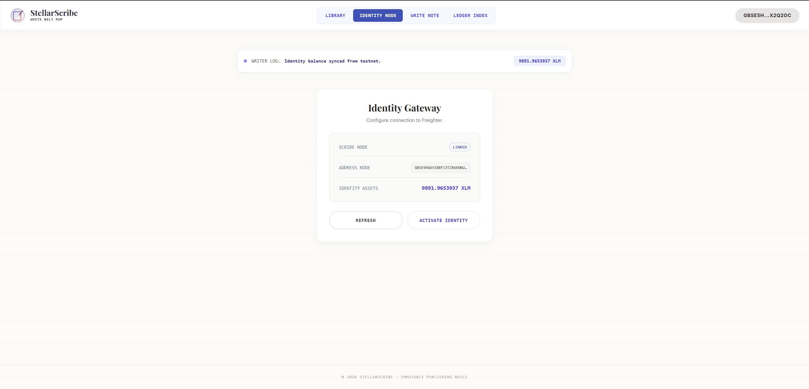
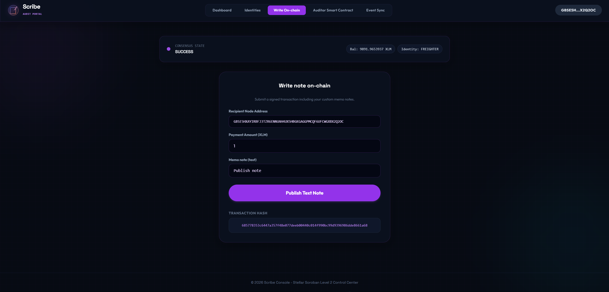

# 🚀 StellarScribe: AI-Driven Expense Auditor

StellarScribe is an AI-driven expense auditing and protocol verification platform built on the Stellar network and Soroban smart contracts. It enables organizations to verify expense claims, enforce policy compliance, and audit payments trustlessly on-chain.

---

## 📁 Project Structure
The repository is organized into progressive levels:
- `level-1-white-belt/`:
  - `frontend/`: React + Vite frontend implementing explicit wallet permissions (`setAllowed`, `requestAccess`), address retrieval, balance fetching, and transaction signing via `@stellar/freighter-api`.
  - `contracts/expense_auditor/`: Soroban Rust smart contract source code (`Cargo.toml`, `src/lib.rs`).
- `level-2-yellow-belt/`:
  - `contracts/expense_auditor/`: Soroban Rust smart contract managing expense audit logs and policy approvals.
  - `frontend/`: React + Vite auditor control center with multi-wallet support (`@creit.tech/stellar-wallets-kit`).
- `expense_auditor/`: Top-level Soroban Rust smart contract package (`Cargo.toml`, `src/lib.rs`).
- `contracts/expense_auditor/`: Root level Soroban Rust smart contract package (`Cargo.toml`, `src/lib.rs`).

---

## ⚙️ StellarScribe Audit Protocol



---

## 🥋 Level 1: White Belt (MVP Foundation)

### 📝 Requirements & Features
- **Wallet Permissions & Address Retrieval:** Explicitly executes `setAllowed()`, `requestAccess()`, and `getAddress()` / `getPublicKey()` from `@stellar/freighter-api` without conditional bypasses.
- **Transaction Signing:** Unconditional XDR creation and signing via `signTransaction()` on Stellar Testnet.
- **Horizon Balance Sync:** Retrieve and display native XLM balances.
- **Soroban Contracts:** Smart contract package located in `level-1-white-belt/contracts/expense_auditor/` (`Cargo.toml`, `src/lib.rs`).

### 💻 How to Run Locally
1. Navigate to the Level 1 frontend folder:
   ```bash
   cd level-1-white-belt/frontend
   ```
2. Install dependencies:
   ```bash
   npm install --ignore-scripts
   ```
3. Run the Vite development server:
   ```bash
   npm run dev
   ```

### 📸 Submission Screenshots

#### Wallet Connection, Balance Display, & Successful Testnet Audit Submission


---

## 🟡 Level 2: Yellow Belt (Smart Contracts & Event Sync)

### 📝 Requirements & Features
- **Multi-Wallet Support:** Multi-wallet selection panel for Freighter, MetaMask (EVM/Snap), xBull, and LOBSTR using `@creit.tech/stellar-wallets-kit`.
- **Soroban Smart Contract:** Connects to the compiled Rust `expense_auditor` smart contract deployed on Stellar Testnet located in `level-2-yellow-belt/contracts/expense_auditor/`.
- **Exception Compliance:** 3 handled error conditions (`WalletNotFound`, `WalletConnectionRejected`, `InsufficientBalance`).
- **Audit Sync Stream:** Event subscription log updating in real-time by querying Horizon audit transactions.

### 💻 How to Run Locally
1. Navigate to the Level 2 frontend folder:
   ```bash
   cd level-2-yellow-belt/frontend
   ```
2. Install the necessary dependencies:
   ```bash
   npm install --ignore-scripts
   ```
3. Launch the development server:
   ```bash
   npm run dev
   ```

### ⚙️ Verification Details
Soroban contract ID - CC2UJP6YAUW5WXAYOM2227FUYHPY5S2IXMSMC65SVLF6ZHOAVFKVBTDH

Transaction Hash: 685778353c6447a357f48e077deeb00440c014f990bc99d9396986dde8661a68

### 🔍 Proof of Deployed Testnet Contract & Transaction Links
- **Testnet Contract:** [Stellar Expert - Contract CC2UJP6YAUW5...](https://stellar.expert/explorer/testnet/contract/CC2UJP6YAUW5WXAYOM2227FUYHPY5S2IXMSMC65SVLF6ZHOAVFKVBTDH)
- **Testnet Transaction Hash:** [Stellar Expert - Transaction 68577835...](https://stellar.expert/explorer/testnet/tx/685778353c6447a357f48e077deeb00440c014f990bc99d9396986dde8661a68)

### 📸 Submission Screenshots

#### Deployed Smart Contract Called & Audit Logged

