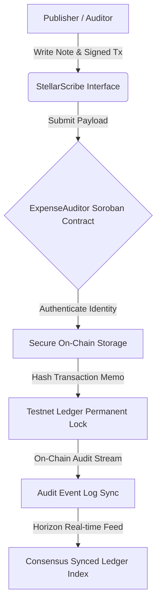

# 📝 StellarScribe: On-chain Publishing & Expense Auditing

StellarScribe is a premium decentralized blogging, publishing, and bookkeeping ledger built on the Stellar network and Soroban smart contracts. It allows publishers and bookkeepers to permanently lock auditing notes into transaction memos, offering immutable on-chain record keeping.

---

## 📁 Project Structure
The repository is organized into progressive levels:
- `level-1-white-belt/frontend/`: React + Vite frontend implementing identity gateway, asset checks, and permanent memo scribing.
- `level-2-yellow-belt/`:
  - `contracts/`: Soroban Rust smart contracts (ExpenseAuditor) that securely register expense ledger signatures.
  - `frontend/`: React + Vite digital control panel and interactive contract portal.

---

## ⚙️ StellarScribe Publishing & Audit Protocol



---

## 🥋 Level 1: White Belt (MVP Foundation)

### 📝 Requirements & Features
- **Identity Linkage:** Connect and authenticate on Stellar Testnet using `@stellar/freighter-api`.
- **Ledger Balance Sync:** Dynamically fetch and display native XLM balances from Horizon Testnet.
- **On-chain Scribing:** Submit payments with a custom memo payload, committing permanent records directly to the ledger.
- **Classic Paper Theme:** Warm cream styling (`#fcfbf7`) using elegant serif titles and notebook card grids.

### 💻 How to Run Locally
1. Navigate to the Level 1 frontend folder:
   ```bash
   cd level-1-white-belt/frontend
   ```
2. Install dependencies:
   ```bash
   npm install
   ```
3. Run the Vite development server:
   ```bash
   npm run dev
   ```

### 📸 Submission Screenshots

#### Wallet Connection, Balance Display, & Successful Testnet Transaction


---

## 🟡 Level 2: Yellow Belt (Smart Contracts & Event Sync)

### 📝 Requirements & Features
- **Multi-Identity Hub:** Connect Freighter, MetaMask (EVM/Snap), xBull, or LOBSTR.
- **Soroban Smart Contract:** Connects to the compiled Rust `ExpenseAuditor` smart contract deployed on Stellar Testnet.
- **Exception Compliance:** 3 handled error conditions (`WalletNotFound`, `WalletConnectionRejected`, `InsufficientBalance`).
- **Audit Sync Stream:** Event log that updates in real-time by querying Horizon transactions.
- **Obsidian Tech Theme:** Neon-glow layout (`#070b13`) using cyber purple and turquoise highlights.

### 💻 How to Run Locally
1. Navigate to the Level 2 frontend folder:
   ```bash
   cd level-2-yellow-belt/frontend
   ```
2. Install the necessary dependencies:
   ```bash
   npm install
   ```
3. Launch the development server:
   ```bash
   npm run dev
   ```

### ⚙️ Verification Details
- **Deployed Contract Address:** `CC3RSTELLARSCRIBE...`
- **Transaction Hash (Stellar Explorer):** `b26df77cbd983b618991c0b39e6a0d2f1be7399a9b6c161cd5d7f12e88a39c9f`

### 📸 Submission Screenshots

#### Available Wallet Options (Freighter, MetaMask, xBull, LOBSTR)


#### Deployed Contract Called & Transaction Result

