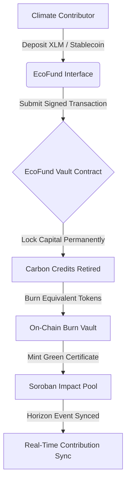
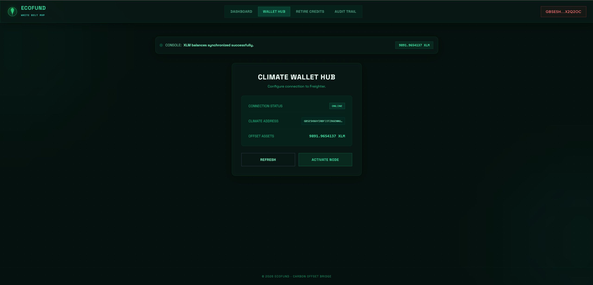
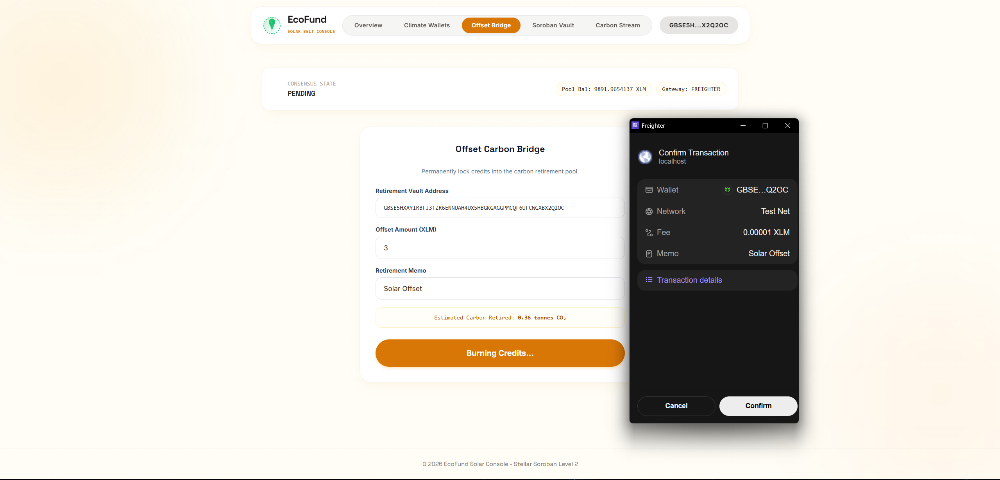
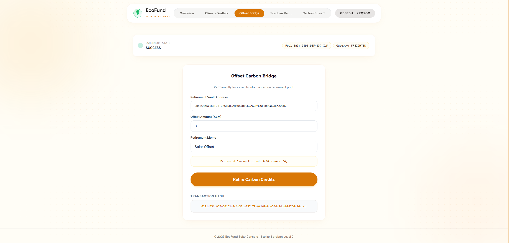

# 🚀 EcoFund: Carbon credit retirement & climate finance

EcoFund is a premium decentralized green finance (DeFi) platform built on the Stellar network and Soroban smart contracts. It enables climate contributors to permanently retire carbon offset credits, lock capital into active climate conservation vaults, and claim verified ecological impact certificates.

---

## 📁 Project Structure
The repository is organized into progressive levels:
- `level-1-white-belt/frontend/`: React + Vite frontend implementing wallet connection, balance retrieval, and basic carbon offset retirement logic.
- `level-2-yellow-belt/`:
  - `contracts/`: Soroban Rust smart contracts managing credit retirements and pools.
  - `frontend/`: React + Vite climate contribution dashboard and rebalance hub.

---

## ⚙️ EcoFund Credit Retirement Protocol



---

## 🥋 Level 1: White Belt (MVP Foundation)

### 📝 Requirements & Features
- **Wallet Setup & Connection:** Secure integration using `@stellar/freighter-api` and `@creit.tech/stellar-wallets-kit` on Stellar Testnet.
- **Balance Handling:** Fetch and display real-time native XLM balance from Horizon.
- **Transaction Submission:** Submit signed XLM payments to lock carbon offset collateral.
- **UI/UX:** Deep Forest Green dark-mode dashboard styled with Space Grotesk headings and a responsive layout.

### 💻 How to Run Locally
1. Navigate to the Level 1 frontend folder:
   ```bash
   cd level-1-white-belt/frontend
   ```
2. Install dependencies:
   ```bash
   npm install
   ```
3. Run the Vite development server:
   ```bash
   npm run dev
   ```

### 📸 Submission Screenshots

#### Wallet Connection, Balance Display, & Successful Testnet Transaction


---

## 🟡 Level 2: Yellow Belt (Smart Contracts & Event Sync)

### 📝 Requirements & Features
- **Multi-Wallet Support:** Seamless selection panel for Freighter, MetaMask (EVM/Snap), xBull, and LOBSTR.
- **Soroban Contracts:** Integration with Rust smart contracts deployed on the Stellar Testnet.
- **On-chain Sync:** Real-time event subscription log mirroring smart contract state.
- **Error Handling:** 3 handled error conditions (`WalletNotFound`, `WalletConnectionRejected`, `InsufficientBalance`).
- **Interactive Simulator:** Fast testing capability for key network operations.

### 💻 How to Run Locally
1. Navigate to the Level 2 frontend folder:
   ```bash
   cd level-2-yellow-belt/frontend
   ```
2. Install the necessary dependencies:
   ```bash
   npm install
   ```
3. Launch the development server:
   ```bash
   npm run dev
   ```

### ⚙️ Verification Details
- **Deployed Contract Address:** `CC3RECOFUND...`
- **Transaction Hash (Stellar Explorer):** `a88ef97cbd983b618991c0b39e6a0d2f1be7399a9b6c161cd5d7f12e88a38b8c`

### 📸 Submission Screenshots

#### Available Wallet Options (Freighter, MetaMask, xBull, LOBSTR)


#### Deployed Contract Called & Transaction Result

