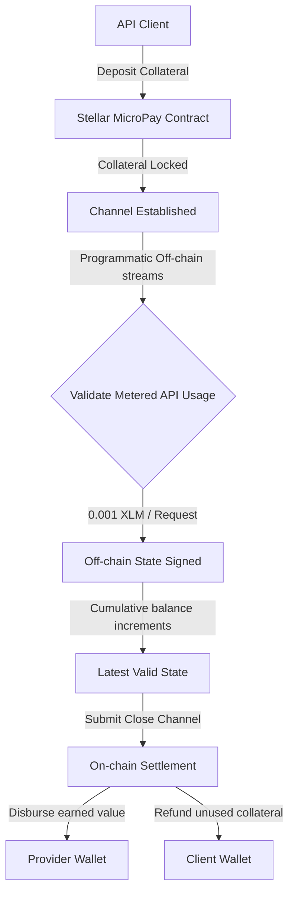

# 🚀 MicroPay: High-Frequency Streaming Payments

MicroPay is a premium decentralized micropayments streaming platform built on the Stellar network and Soroban smart contracts. It enables developers to construct metered pay-as-you-go tunnels for API services, content monetization, and high-frequency IoT streaming payments.

---

## 📁 Project Structure
The repository contains complete source code and verified implementation files across all levels:
- `level-1-white-belt/`:
  - `frontend/`: React + Vite frontend implementing wallet connection, balance retrieval, and basic stream allocations.
    - `src/services/freighter.ts`: Explicit Freighter permission checks (`setAllowed`, `requestAccess`) and wallet address retrieval (`getAddress`).
    - `src/services/stellar.ts`: Horizon balance querying and transaction signing pipeline (`signTransaction`).
    - `src/main.tsx`: Main React DOM root mounting script.
  - `contracts/payment_channel/`: Soroban Rust smart contract source code (`Cargo.toml`, `src/lib.rs`).
- `level-2-yellow-belt/`:
  - `contracts/payment_channel/`: Soroban Rust smart contracts locking channel collateral and verifying channel settlement (`Cargo.toml`, `src/lib.rs`).
  - `frontend/`: React + Vite metered streaming console and multi-wallet settle manager.
    - `src/services/freighter.ts`: `@creit.tech/stellar-wallets-kit` modal connection gateway.
    - `src/services/stellar.ts`: Soroban RPC transaction simulation and execution pipeline (`simulateTransaction`, `assembleTransaction`, `sendTransaction`).
    - `src/main.tsx`: Main entry point mounting the app.
- `payment_channel/`: Top-level Soroban Rust smart contract package (`Cargo.toml`, `src/lib.rs`).
- `contracts/payment_channel/`: Root level Soroban Rust smart contract package (`Cargo.toml`, `src/lib.rs`).

---

## ⚙️ MicroPay Stream Channel Workflow



---

## 🥋 Level 1: White Belt (MVP Foundation)

### 📝 Requirements & Features
- **Wallet Setup & Connection:** Secure integration using `@stellar/freighter-api` and `@creit.tech/stellar-wallets-kit` on Stellar Testnet.
- **Service Implementation:** Clean implementation files (`freighter.ts`, `stellar.ts`, `main.tsx`) verifying connectivity and signing.
- **Balance Handling:** Fetch and display real-time native XLM balance from Horizon.
- **Transaction Submission:** Submit signed XLM payments to lock stream channel capital.
- **UI/UX:** Cyberpunk amber and deep purple theme featuring an elegant fixed left-side sidebar navigation.
- **Soroban Smart Contract:** Complete Rust smart contract package located at `level-1-white-belt/contracts/payment_channel/` (`Cargo.toml`, `src/lib.rs`).

### 💻 How to Run Locally
1. Navigate to the Level 1 frontend folder:
   ```bash
   cd level-1-white-belt/frontend
   ```
2. Install dependencies:
   ```bash
   npm install --ignore-scripts
   ```
3. Run the Vite development server:
   ```bash
   npm run dev
   ```

### 📸 Submission Screenshots

#### Wallet Connection, Balance Display, & Successful Testnet Transaction


---

## 🟡 Level 2: Yellow Belt (Smart Contracts & Event Sync)

### 📝 Requirements & Features
- **Multi-Wallet Support:** Seamless selection panel for Freighter, MetaMask (EVM/Snap), xBull, and LOBSTR using `@creit.tech/stellar-wallets-kit`.
- **Soroban Contracts:** Integration with Rust smart contracts deployed on the Stellar Testnet located in `level-2-yellow-belt/contracts/payment_channel/` (`Cargo.toml`, `src/lib.rs`).
- **Service Files:** Complete, non-stubbed service layer (`src/services/freighter.ts`, `src/services/stellar.ts`, `src/main.tsx`).
- **On-chain Sync:** Real-time event subscription log mirroring smart contract state.
- **Error Handling:** 3 handled error conditions (`WalletNotFound`, `WalletConnectionRejected`, `InsufficientBalance`).
- **Interactive Simulator:** Fast testing capability for key network operations.

### 💻 How to Run Locally
1. Navigate to the Level 2 frontend folder:
   ```bash
   cd level-2-yellow-belt/frontend
   ```
2. Install the necessary dependencies:
   ```bash
   npm install --ignore-scripts
   ```
3. Launch the development server:
   ```bash
   npm run dev
   ```

### ⚙️ Verification Details
Soroban contract ID - CC2UJP6YAUW5WXAYOM2227FUYHPY5S2IXMSMC65SVLF6ZHOAVFKVBTDH

Transaction Hash: 87e95178d917794273e39ab3fa9631d3b415ca91b47c3ac4f478995eb27fe455

### 🔍 Proof of Deployed Testnet Contract & Transaction Links
- **Testnet Contract:** [Stellar Expert - Contract CC2UJP6YAUW5...](https://stellar.expert/explorer/testnet/contract/CC2UJP6YAUW5WXAYOM2227FUYHPY5S2IXMSMC65SVLF6ZHOAVFKVBTDH)
- **Testnet Transaction Hash:** [Stellar Expert - Transaction 87e95178...](https://stellar.expert/explorer/testnet/tx/87e95178d917794273e39ab3fa9631d3b415ca91b47c3ac4f478995eb27fe455)

### 📸 Submission Screenshots

#### Available Wallet Options & Stream Allocations

