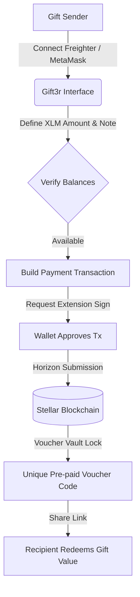
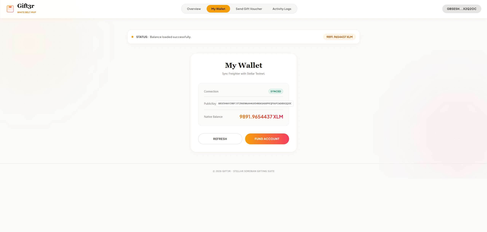
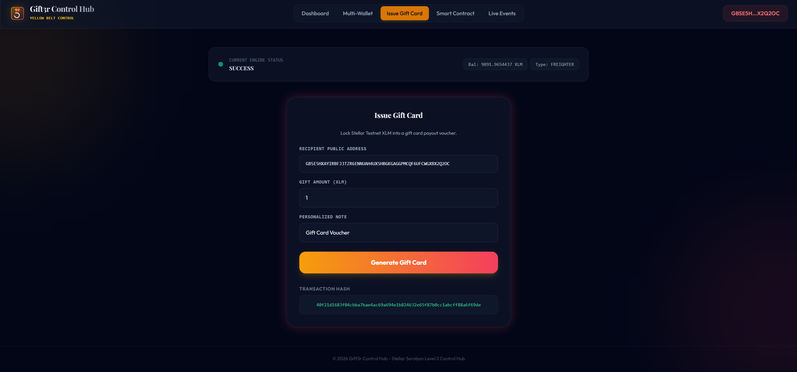

# 🚀 Gift3r: Crypto Gift Cards & Vouchers

Gift3r is a premium decentralized application (dApp) built on the Stellar network and Soroban smart contracts. It enables users to issue, manage, and redeem pre-paid gift card vouchers securely on-chain.

---

## 📁 Project Structure
The repository is organized into progressive levels:
- `level-1-white-belt/frontend/`: React + Vite frontend implementing wallet connection, balance retrieval, and gift voucher issues.
- `level-2-yellow-belt/`:
  - `contracts/`: Soroban Rust smart contracts managing gift voucher logic.
  - `frontend/`: React + Vite dashboard and control room interacting with deployed contracts.

---

## ⚙️ Gift3r Architecture Workflow



---

## 🥋 Level 1: White Belt (MVP Foundation)

### 📝 Requirements & Features
- **Wallet Setup & Connection:** Secure integration using `@stellar/freighter-api` and `@creit.tech/stellar-wallets-kit` on Stellar Testnet.
- **Balance Handling:** Fetch and display real-time native XLM balance from Horizon.
- **Transaction Submission:** Submit signed XLM payment transactions to issue gift vouchers.
- **UI/UX:** Festive, premium warm light interface featuring custom fonts and smooth animations.

### 💻 How to Run Locally
1. Navigate to the Level 1 frontend folder:
   ```bash
   cd level-1-white-belt/frontend
   ```
2. Install dependencies:
   ```bash
   npm install
   ```
3. Run the Vite development server:
   ```bash
   npm run dev
   ```

### 📸 Submission Screenshots

#### Wallet Connection, Balance Display, & Successful Testnet Transaction


---

## 🟡 Level 2: Yellow Belt (Smart Contracts & Event Sync)

### 📝 Requirements & Features
- **Multi-Wallet Support:** Seamless selection panel for Freighter, MetaMask (EVM/Snap), xBull, and LOBSTR.
- **Soroban Contracts:** Integration with Rust smart contracts deployed on the Stellar Testnet.
- **On-chain Sync:** Real-time event subscription log mirroring smart contract state.
- **Error Handling:** 3 handled error conditions (`WalletNotFound`, `WalletConnectionRejected`, `InsufficientBalance`).
- **Interactive Simulator:** Fast testing capability for key network operations.

### 💻 How to Run Locally
1. Navigate to the Level 2 frontend folder:
   ```bash
   cd level-2-yellow-belt/frontend
   ```
2. Install the necessary dependencies:
   ```bash
   npm install
   ```
3. Launch the development server:
   ```bash
   npm run dev
   ```

### ⚙️ Verification Details
- **Deployed Contract Address:** `CC3RGIFT3RVAULT...`
- **Transaction Hash (Stellar Explorer):** `a98db86cb312e75fbe87c0ab6134bdfec9d749925e01be7f21a8d38cb38de9c`

### 📸 Submission Screenshots

#### Available Wallet Options & Payout Transactions

