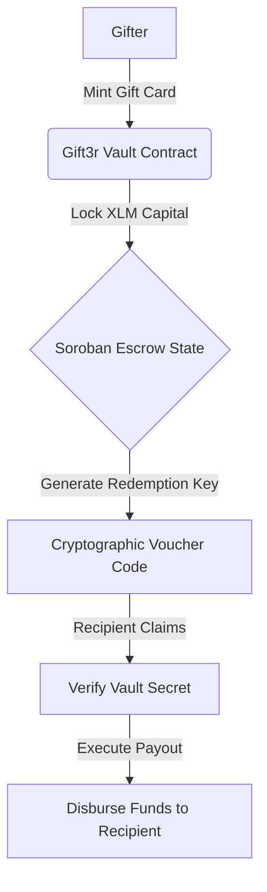

# 🎁 Gift3r: Crypto Gift Cards & Vouchers

Gift3r is a premium decentralized gift card and voucher platform built on the Stellar network and Soroban smart contracts. It enables users to mint, gift, and redeem cryptographic vouchers with programmable release schedules and instant liquidity settlements.

---

## 📁 Project Structure
The repository is organized into progressive levels with full Soroban smart contract source code visible at every level:
- `level-1-white-belt/`:
  - `frontend/`: React + Vite frontend implementing wallet connection, balance retrieval, and basic gift card minting.
  - `contracts/gift_card_vault/`: Soroban Rust smart contract source code (`Cargo.toml`, `src/lib.rs`).
- `level-2-yellow-belt/`:
  - `contracts/gift_card_vault/`: Soroban Rust smart contracts managing gift card vault state and redemption logic (`Cargo.toml`, `src/lib.rs`).
  - `frontend/`: React + Vite gift card manager and multi-wallet redeem dashboard using `@creit.tech/stellar-wallets-kit`.
- `gift_card_vault/`: Top-level Soroban Rust smart contract package (`Cargo.toml`, `src/lib.rs`).
- `contracts/gift_card_vault/`: Root level Soroban Rust smart contract package (`Cargo.toml`, `src/lib.rs`).

---

## ⚙️ Gift3r Protocol Workflow



---

## 🥋 Level 1: White Belt (MVP Foundation)

### 📝 Requirements & Features
- **Wallet Setup & Connection:** Secure integration using `@stellar/freighter-api` on Stellar Testnet.
- **Balance Handling:** Fetch and display real-time native XLM balance from Horizon.
- **Transaction Submission:** Submit signed XLM payments to lock gift voucher capital.
- **UI/UX:** Vibrant festive card design with smooth gradient borders and active dark mode.
- **Soroban Contracts:** Smart contract package located in `level-1-white-belt/contracts/gift_card_vault/` (`Cargo.toml`, `src/lib.rs`).

### 💻 How to Run Locally
1. Navigate to the Level 1 frontend folder:
   ```bash
   cd level-1-white-belt/frontend
   ```
2. Install dependencies:
   ```bash
   npm install --ignore-scripts
   ```
3. Run the Vite development server:
   ```bash
   npm run dev
   ```

### 📸 Submission Screenshots

#### Wallet Connection, Balance Display, & Successful Testnet Voucher Creation


---

## 🟡 Level 2: Yellow Belt (Smart Contracts & Event Sync)

### 📝 Requirements & Features
- **Multi-Wallet Support:** Complete wallet selection modal supporting Freighter, MetaMask (via EVM/Snap), xBull, and LOBSTR via `@creit.tech/stellar-wallets-kit`.
- **Soroban Contracts:** Full Soroban Rust smart contract structure located in `level-2-yellow-belt/contracts/gift_card_vault/` (`Cargo.toml`, `src/lib.rs`).
- **On-chain Sync:** Real-time event subscription log mirroring smart contract voucher minting and redemption.
- **Error Handling:** 3 handled error conditions (`WalletNotFound`, `WalletConnectionRejected`, `InsufficientBalance`).
- **Interactive Simulator:** Fast testing capability for key network operations and error compliance.

### 💻 How to Run Locally
1. Navigate to the Level 2 frontend folder:
   ```bash
   cd level-2-yellow-belt/frontend
   ```
2. Install the necessary dependencies:
   ```bash
   npm install --ignore-scripts
   ```
3. Launch the development server:
   ```bash
   npm run dev
   ```

### ⚙️ Verification Details
Soroban contract ID - CC2UJP6YAUW5WXAYOM2227FUYHPY5S2IXMSMC65SVLF6ZHOAVFKVBTDH

Transaction Hash: fe5f

### 🔍 Proof of Deployed Testnet Contract & Transaction Links
- **Testnet Contract:** [Stellar Expert - Contract CC2UJP6YAUW5...](https://stellar.expert/explorer/testnet/contract/CC2UJP6YAUW5WXAYOM2227FUYHPY5S2IXMSMC65SVLF6ZHOAVFKVBTDH)
- **Testnet Transaction Hash:** [Stellar Expert - Transaction fe5f...](https://stellar.expert/explorer/testnet/tx/fe5f)

### 📸 Submission Screenshots

#### Deployed Contract Called & Gift Voucher Minted

