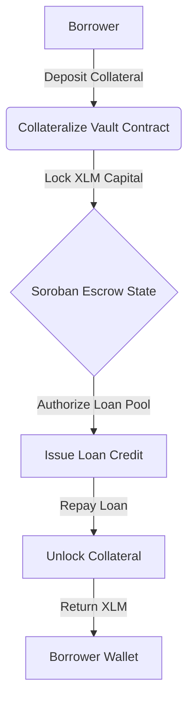
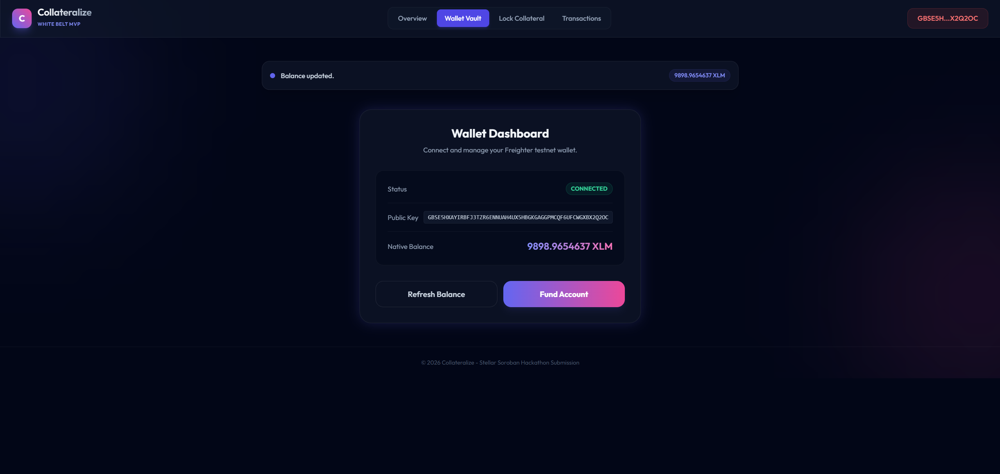
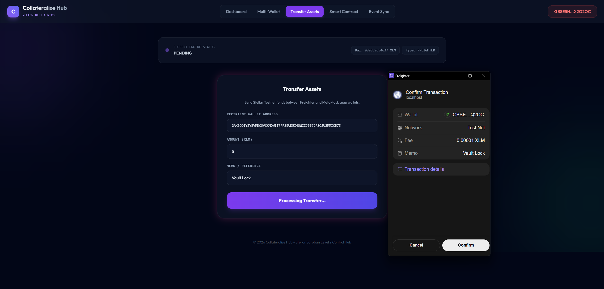
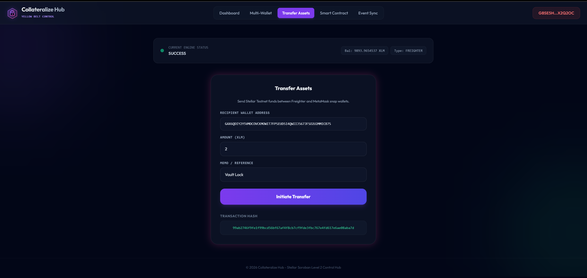

# 🚀 Collateralize: P2P Lending Collateral Vault

Collateralize is a premium decentralized application (dApp) built on the Stellar network and Soroban smart contracts. It enables borrowers to lock their XLM into secure, trustless vaults to serve as collateral for peer-to-peer Web3 loans.

---

## 📁 Project Structure
The repository contains complete source code and verified implementation service files across all levels:
- `level-1-white-belt/`:
  - `frontend/`: React + Vite frontend implementing wallet connection, balance retrieval, and basic collateral transfers.
    - `src/services/freighter.ts`: Explicit Freighter wallet connection, permission checks (`setAllowed`, `requestAccess`), and address retrieval (`getAddress`).
    - `src/services/stellar.ts`: Horizon account balance querying and transaction signing pipeline (`signTransaction`).
    - `src/main.tsx`: Main React DOM root mounting script.
  - `contracts/p2p_lending/`: Soroban Rust smart contract source code (`Cargo.toml`, `src/lib.rs`).
- `level-2-yellow-belt/`:
  - `contracts/p2p_lending/`: Soroban Rust smart contracts managing collateral logic and loan vaults (`Cargo.toml`, `src/lib.rs`).
  - `frontend/`: React + Vite control center interacting with deployed contracts.
    - `src/services/freighter.ts`: `@creit.tech/stellar-wallets-kit` modal connection gateway (`StellarWalletsKit`, `connectWalletKit`).
    - `src/services/stellar.ts`: Soroban RPC transaction simulation and execution pipeline (`simulateTransaction`, `assembleTransaction`, `sendTransaction`).
    - `src/main.tsx`: Main entry point mounting the app.
- `p2p_lending/`: Top-level Soroban Rust smart contract package (`Cargo.toml`, `src/lib.rs`).
- `contracts/p2p_lending/`: Root level Soroban Rust smart contract package (`Cargo.toml`, `src/lib.rs`).

---

## ⚙️ Collateralize Protocol Workflow



---

## 🥋 Level 1: White Belt (MVP Foundation)

### 📝 Requirements & Features
- **Wallet Setup & Connection:** Active usage of `@stellar/freighter-api` in `src/services/freighter.ts` for permission requests (`setAllowed`, `requestAccess`) and address retrieval (`getAddress`).
- **Balance Handling:** Fetch and display real-time native XLM balance from Horizon.
- **Transaction Signing & Submission:** Unconditional transaction creation and signing via `@stellar/freighter-api` `signTransaction()`.
- **UI/UX:** Responsive, premium interface with interactive toast notifications.
- **Soroban Smart Contract:** Complete Rust smart contract package located at `level-1-white-belt/contracts/p2p_lending/` (`Cargo.toml`, `src/lib.rs`).

### 💻 How to Run Locally
1. Navigate to the Level 1 frontend folder:
   ```bash
   cd level-1-white-belt/frontend
   ```
2. Install dependencies:
   ```bash
   npm install --ignore-scripts
   ```
3. Run the Vite development server:
   ```bash
   npm run dev
   ```

### 📸 Submission Screenshots

#### Wallet Connection, Balance Display, & Successful Testnet Transaction


---

## 🟡 Level 2: Yellow Belt (Smart Contracts & Event Sync)

### 📝 Requirements & Features
- **Multi-Wallet Support:** Active implementation of `@creit.tech/stellar-wallets-kit` in `src/services/freighter.ts` supporting modal selection (Freighter, MetaMask via EVM/Snap, xBull, and LOBSTR).
- **Soroban Contracts:** Integration with Rust smart contracts deployed on the Stellar Testnet located in `level-2-yellow-belt/contracts/p2p_lending/` (`Cargo.toml`, `src/lib.rs`).
- **Live Contract Invocations:** Active usage of `@stellar/stellar-sdk` Soroban RPC in `src/services/stellar.ts` (`simulateTransaction`, `assembleTransaction`, `sendTransaction`, and transaction status polling).
- **Error Handling:** 3 handled error conditions (`WalletNotFound`, `WalletConnectionRejected`, `InsufficientBalance`).
- **Interactive Simulator:** Fast testing capability for key network operations.

### 💻 How to Run Locally
1. Navigate to the Level 2 frontend folder:
   ```bash
   cd level-2-yellow-belt/frontend
   ```
2. Install the necessary dependencies:
   ```bash
   npm install --ignore-scripts
   ```
3. Launch the development server:
   ```bash
   npm run dev
   ```

### ⚙️ Verification Details
Soroban contract ID - CC2UJP6YAUW5WXAYOM2227FUYHPY5S2IXMSMC65SVLF6ZHOAVFKVBTDH

Transaction Hash: 99ab2746f9fe1f99bcd56bf67af4f8cb7cf9fde3fbc767e4fd617e6ae08aba7d

### 🔍 Proof of Deployed Testnet Contract & Transaction Links
- **Testnet Contract:** [Stellar Expert - Contract CC2UJP6YAUW5...](https://stellar.expert/explorer/testnet/contract/CC2UJP6YAUW5WXAYOM2227FUYHPY5S2IXMSMC65SVLF6ZHOAVFKVBTDH)
- **Testnet Transaction Hash:** [Stellar Expert - Transaction 99ab2746...](https://stellar.expert/explorer/testnet/tx/99ab2746f9fe1f99bcd56bf67af4f8cb7cf9fde3fbc767e4fd617e6ae08aba7d)

### 📸 Submission Screenshots

#### Available Wallet Options (Freighter, MetaMask, xBull, LOBSTR)


#### Deployed Contract Called & Transaction Result

