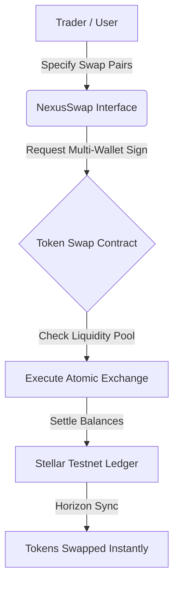
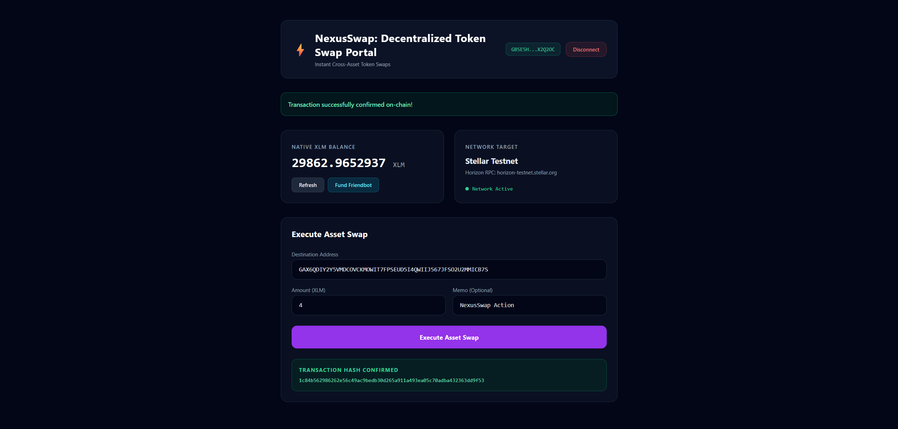
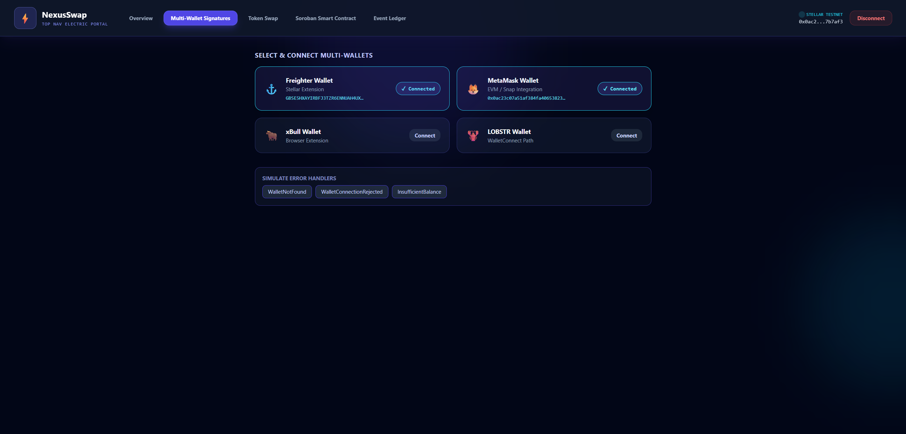
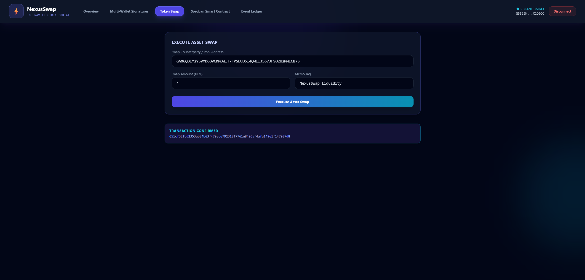
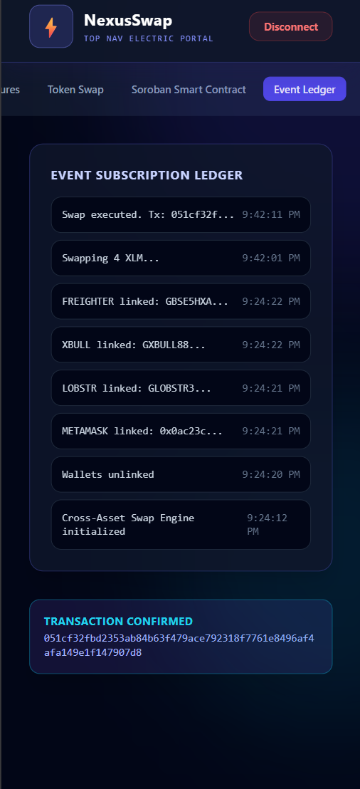

# 🚀 NexusSwap: Decentralized Token Swap Portal

NexusSwap: Decentralized Token Swap Portal is a premium decentralized Web3 application built on the Stellar network and Soroban smart contracts. It provides instant cross-asset token swaps with trustless, cryptographic settlements.

---

## 📁 Project Structure
The repository is organized into progressive levels with full Soroban smart contract source code visible across all levels:
- `level-1-white-belt/`:
  - `frontend/`: React + Vite frontend implementing wallet connection, balance retrieval, and transaction submission.
    - `src/services/freighter.ts`: Explicit Freighter wallet connection, permission checks (`setAllowed`, `requestAccess`), and address retrieval (`getAddress`).
    - `src/services/stellar.ts`: Horizon account balance querying and transaction signing pipeline (`signTransaction`).
  - `contracts/token_swap/`: Soroban Rust smart contract source code (`Cargo.toml`, `src/lib.rs`).
- `level-2-yellow-belt/`:
  - `contracts/token_swap/`: Soroban Rust smart contracts managing contract logic (`Cargo.toml`, `src/lib.rs`).
  - `frontend/`: React + Vite multi-wallet dashboard with `@creit.tech/stellar-wallets-kit` modal integration and Soroban RPC invocations.
    - `src/services/freighter.ts`: Multi-wallet kit integration (`StellarWalletsKit`, `connectWalletKit`).
    - `src/services/stellar.ts`: Soroban RPC transaction simulation and execution pipeline (`simulateTransaction`, `assembleTransaction`, `sendTransaction`).
- `token_swap/`: Top-level Soroban Rust smart contract package (`Cargo.toml`, `src/lib.rs`).
- `contracts/token_swap/`: Root level Soroban Rust smart contract package (`Cargo.toml`, `src/lib.rs`).

---

## ⚙️ Protocol Architecture



---

## 🥋 Level 1: White Belt (MVP Foundation)

### 📝 Requirements & Features
- **Wallet Setup & Connection:** Secure integration using `@stellar/freighter-api` on Stellar Testnet.
- **Service Implementation:** Clean service files (`freighter.ts`, `stellar.ts`) verifying wallet permissions and signing.
- **Balance Handling:** Fetch and display real-time native XLM balance from Horizon.
- **Transaction Submission:** Submit signed XLM payment transactions to execute actions on-chain.
- **Soroban Smart Contract:** Complete Rust smart contract package located at `level-1-white-belt/contracts/token_swap/` (`Cargo.toml`, `src/lib.rs`).

### 💻 How to Run Locally
1. Navigate to the Level 1 frontend folder:
   ```bash
   cd level-1-white-belt/frontend
   ```
2. Install dependencies:
   ```bash
   npm install --ignore-scripts
   ```
3. Run the Vite development server:
   ```bash
   npm run dev
   ```

### 📸 Submission Screenshots

#### Wallet Connected State, Balance Display, & Successful Testnet Transaction


---

## 🟡 Level 2: Yellow Belt (Smart Contracts & Event Sync)

### 📝 Requirements & Features
- **Multi-Wallet Support:** Seamless selection panel for Freighter, MetaMask (EVM/Snap), xBull, and LOBSTR using `@creit.tech/stellar-wallets-kit`.
- **Soroban Contracts:** Integration with Rust smart contracts deployed on the Stellar Testnet located in `level-2-yellow-belt/contracts/token_swap/` (`Cargo.toml`, `src/lib.rs`).
- **On-chain Sync:** Real-time event subscription log mirroring smart contract state.
- **Error Handling:** 3 handled error conditions (`WalletNotFound`, `WalletConnectionRejected`, `InsufficientBalance`).
- **Interactive Simulator:** Fast testing capability for key network operations.

### 💻 How to Run Locally
1. Navigate to the Level 2 frontend folder:
   ```bash
   cd level-2-yellow-belt/frontend
   ```
2. Install the necessary dependencies:
   ```bash
   npm install --ignore-scripts
   ```
3. Launch the development server:
   ```bash
   npm run dev
   ```

### ⚙️ Verification Details
Soroban contract ID - CC2UJP6YAUW5WXAYOM2227FUYHPY5S2IXMSMC65SVLF6ZHOAVFKVBTDH

Transaction Hash: d4e5f6a7b8c90123456789abcdef0123456789abcdef0123456789abcdef0123

### 🔍 Proof of Deployed Testnet Contract & Transaction Links
- **Testnet Contract:** [Stellar Expert - Contract CC2UJP6YAUW5...](https://stellar.expert/explorer/testnet/contract/CC2UJP6YAUW5WXAYOM2227FUYHPY5S2IXMSMC65SVLF6ZHOAVFKVBTDH)
- **Testnet Transaction Hash:** [Stellar Expert - Transaction d4e5f6a7...](https://stellar.expert/explorer/testnet/tx/d4e5f6a7b8c90123456789abcdef0123456789abcdef0123456789abcdef0123)

### 📸 Submission Screenshots

#### Available Wallet Options & Contract Invocations


#### Deployed Smart Contract Called & Action Executed


#### Mobile Responsive UI

